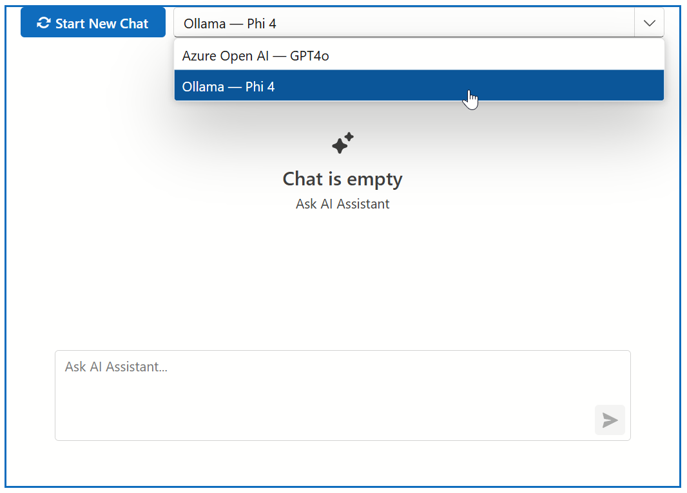

<!-- default badges list -->

<!-- default badges end -->
# Blazor AI Chat — Build a Multi-LLM Chat Application

This example implements a multi-LLM (Large Language Model) chat application. Key considerations include:

* The application uses two models: GPT-4o from Azure OpenAI and Phi4 from Ollama running locally.
* The `IChatClient` interface implementation manages chat clients and conversation histories.
* The interface is built with DevExpress Blazor components: [DxAIChat](https://docs.devexpress.com/Blazor/DevExpress.AIIntegration.Blazor.Chat.DxAIChat), [DxComboBox](https://docs.devexpress.com/Blazor/DevExpress.Blazor.DxComboBox-2), and [DxButton](https://docs.devexpress.com/Blazor/DevExpress.Blazor.DxButton).

This example is based on the following blog post: [DevExpress Blazor AI Chat — Build a Multi-LLM Chat Application](https://int.devexpress.com/community/blogs/aspnet/archive/2025/04/16/devexpress-blazor-ai-chat-build-a-multi-llm-chat-application.aspx).

> [!NOTE]  
> Before launch, add your credentials in the [appsettings.Development.json](CS/DXBlazorCompositeChatClient/appsettings.Development.json) file.

## Files to Review

- [Program.cs](CS/DXBlazorCompositeChatClient/Program.cs)
- [appsettings.Development.json](CS/DXBlazorCompositeChatClient/appsettings.Development.json)
- [ChatClientSession.cs](CS/DXBlazorCompositeChatClient/Services/ChatClientSession.cs)
- [CompositeChatClient.cs](CS/DXBlazorCompositeChatClient/Services/CompositeChatClient.cs)
- [Index.razor](CS/DXBlazorCompositeChatClient/Components/Pages/Index.razor)

## Documentation

- [DevExpress AI-powered Extensions for Blazor](https://docs.devexpress.com/Blazor/405228/ai-powered-extensions)
- [DevExpress Blazor AI Chat Control](https://docs.devexpress.com/Blazor/DevExpress.AIIntegration.Blazor.Chat.DxAIChat)

## More Examples

- [Blazor AI Chat - How to add the DevExpress Blazor AI Chat component to your next Blazor, MAUI, WPF, and WinForms application](https://github.com/DevExpress-Examples/devexpress-ai-chat-samples)
- [Blazor AI Chat — Implement Function/Tool Calling](https://github.com/DevExpress-Examples/blazor-ai-chat-function-calling)
- [Rich Text Editor and HTML Editor for Blazor - How to integrate AI-powered extensions](https://github.com/DevExpress-Examples/blazor-ai-integration-to-text-editors)

<!-- feedback -->
## Does this example address your development requirements/objectives?

 

(you will be redirected to DevExpress.com to submit your response)
<!-- feedback end -->
